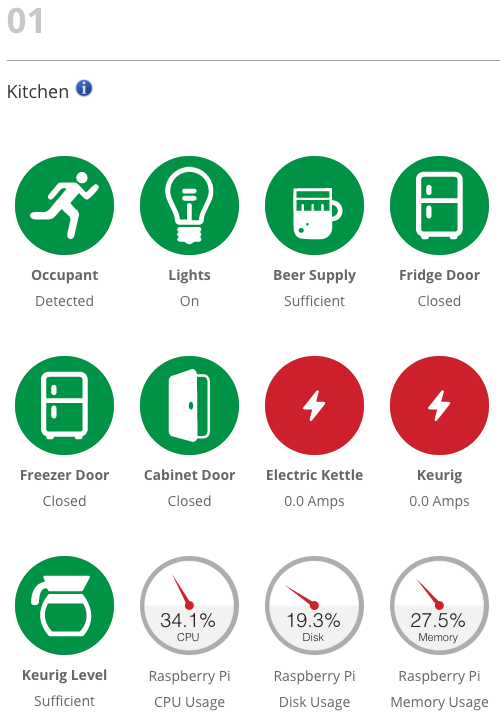

Icons are a strong theme on all nio websites, pitch decks, and videos.

Icons are simple graphics that represent an idea or concept, independent of any particular language, specific words, or phrases

They function as a shorthand for conveying information quickly and memorably. With them, you can gather a lot of information at a glance.

Icons are graphic, bold, simple, modern, concise, and informative.
