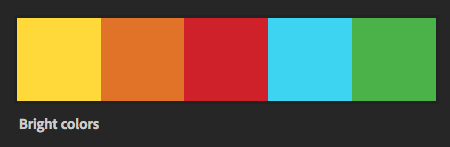
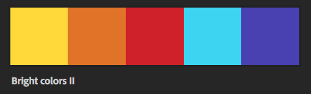
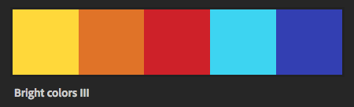
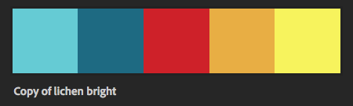
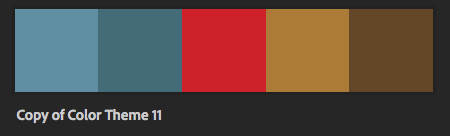
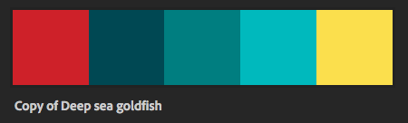
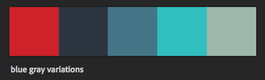
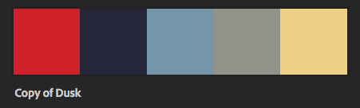
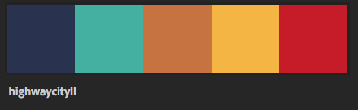

Some variations of color themes with nio red:

Starting with the red and the yellow and blue walls, adding complementary bright colors:

https://color.adobe.com/library/02009a27-0577-4cc1-a71b-bb08e43d764a/theme/c5d59e4b-bb7b-4154-8f2f-00a4dc6af7d9/

Same bright colors but without the green:

https://color.adobe.com/library/02009a27-0577-4cc1-a71b-bb08e43d764a/theme/82e89fce-1a15-4939-a2e5-f3de8901950c/

Same bright colors but less purple, more blue:

https://color.adobe.com/library/02009a27-0577-4cc1-a71b-bb08e43d764a/theme/f3a929b0-295d-4885-a04a-dd712f662085/

Primary colors with red and two blues, two yellows:

https://color.adobe.com/library/02009a27-0577-4cc1-a71b-bb08e43d764a/theme/2fcb6ab7-d8ee-480c-8e22-cf78b0889a54/

More subdued version of above:

https://color.adobe.com/library/02009a27-0577-4cc1-a71b-bb08e43d764a/theme/8efcccf6-0cba-4c3b-966e-194a35447b8a/

Red with three blues, one yellow:

https://color.adobe.com/library/02009a27-0577-4cc1-a71b-bb08e43d764a/theme/cec6c538-7a3c-4dc1-8c73-babc147ef9b2/

Red with blue/gray variations:

https://color.adobe.com/library/02009a27-0577-4cc1-a71b-bb08e43d764a/theme/b4445153-f3e4-4ca5-80a9-12d055fca79c/

Red with colors inspired by dusk:

https://color.adobe.com/library/02009a27-0577-4cc1-a71b-bb08e43d764a/theme/786f2682-1059-45df-8e2e-89610170d1f0/

Colors from a photo of a city at night:

https://color.adobe.com/library/02009a27-0577-4cc1-a71b-bb08e43d764a/theme/8001386a-d85e-4b4b-a58b-19511302ebe1/
